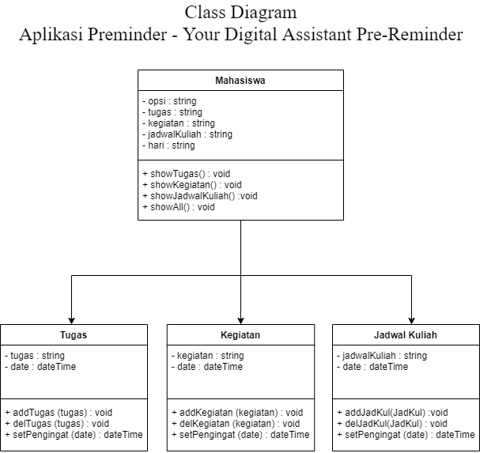

# Preminder
Preminder adalah sebuah aplikasi yang dapat membuat daftar kegiatan apa saja yang harus kita kerjakan. Aplikasi ini diharapkan dapat membantu penggunanya untuk dapat mengatur jadwal dari pengguna.  
  
Repository untuk pemenuhan Tugas Proyek Aplikasi Praktikum Pemrograman Berorientasi Objek 2020 dengan anggota kelompok:  
Mufidus Sani (20/463608/TK/51600)  
Muhammad Arif Hidayat (20/463608/TK/51600)  

## Class Diagram

## Diagram Basis Data

untuk database Kegiatan kami menggunakan file.txt agar lebih bervariasi

## Panduan Penggunaan Aplikasi
Link Youtube : https://www.youtube.com/watch?v=1mFjspUCvvs  
Panduan Aplikasi dalam pdf : https://drive.google.com/file/d/1aJEa0mObdMorhjGpy_T4cQLpcoZFVrxV/view?usp=sharing
